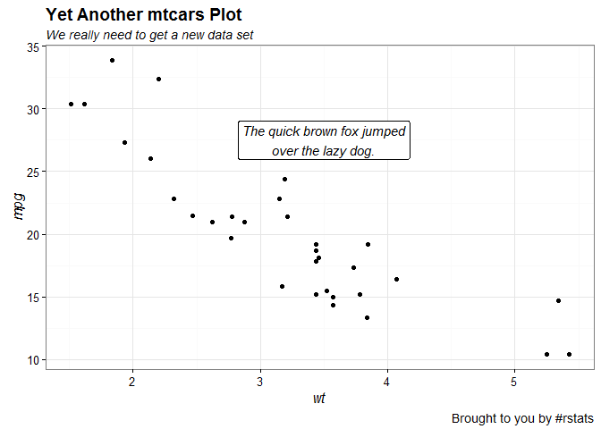
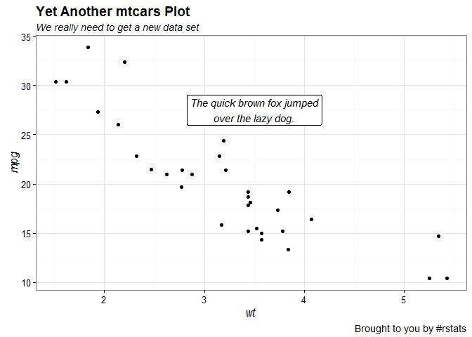
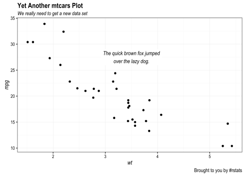
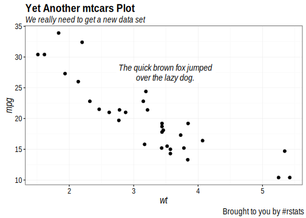

# PDF Device Tests
hrbrmstr  
May 25, 2016  


```r
library(ggplot2)
library(extrafont)
library(svglite)

loadfonts()

gg <- ggplot(mtcars, aes(wt, mpg))
gg <- gg + geom_point()
gg <- gg + geom_label(aes(x=3.5, y=27.5, label="The quick brown fox jumped\nover the lazy dog."),
                      family="Arial Narrow", fontface="italic", size=4, label.size=0)
gg <- gg + labs(title="Yet Another mtcars Plot",
                subtitle="We really need to get a new data set",
                caption="Brought to you by #rstats")
gg <- gg + theme_bw(base_family = "Arial Narrow")
gg <- gg + theme(axis.title=element_text(family="Arial Narrow", face="italic"))
gg <- gg + theme(plot.title=element_text(family="Arial Narrow", face="bold"))
gg <- gg + theme(plot.subtitle=element_text(family="Arial Narrow", face="italic"))
gg <- gg + theme(plot.caption=element_text(family="Arial Narrow", face="plain"))
```

### PNG device

<!-- -->

### JPEG device

<!-- -->

### TIFF device

<!-- -->

### SVG device

<!-- -->

### SVGLITE device

<!-- -->

### PDF device


### CAIRO_PDF device

<!-- -->

### CAIROPDF device

<!-- -->

### WIN.METAFILE device

<!-- -->


### QUARTZ device


